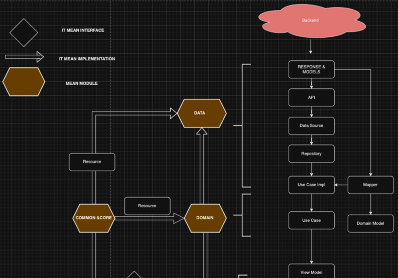

<div align="center">

  

[📚 Docs]() • [💬 Slack]() • [✨ Live Demo]()

</div>

## Tech stack

- Local data storage: [Room](https://developer.android.com/training/data-storage/room)
- Remote network: [Retrofit](https://square.github.io/retrofit/)
- [KotlinX Coroutines](https://kotlinlang.org/docs/coroutines-guide.html) for asynchronous
  programming
  and [Flow](https://kotlinlang.org/docs/flow.html) for reactive programming.
- MVVM pattern
  with [Android Lifecycle ViewModel](https://developer.android.com/topic/libraries/architecture/viewmodel)
- Dependency injection: [Hilt](https://dagger.dev/hilt/)
- Unidirectional data flow with [Flow](https://kotlinlang.org/docs/flow.html)
  and [Channels](https://kotlinlang.org/docs/channels.html)
- Clean architecture: Entity, UseCase, Repository, DataSources
- AndroidX StartUp for initializations

## Architecture

This project has been crafted with the intention of providing a transparent view into my approach
towards software development, including my work methodologies, architectural choices, design pattern
implementations, modularization strategies, code readability enhancements, utilized technologies and
libraries, version control practices, and more. I will ll share all flow and contents



# Contents & Libraries

- MVVM & MVI
- Modularization & Multi Module App Architecture
- Clean Architecture
- Jetpack Compose
- View Binding
- Hilt
- Retrofit
- Navigation Component
- Coroutines
- ViewPager2
- Shimmer
- Material Design
- Espresso
- Centralize Dependencies( With Version Catalogs )
- Hilt Android Testing
- KotlinX Coroutines Test
- Fragment Testing
- Mockk
- Glide
- Lottie
- SwipeRefreshLayout
- Flexbox
- Material Components

## License

This project is licensed under the [MIT License]()

```
MIT License
Copyright (c) 2025, Hoàng Anh Tiến
```